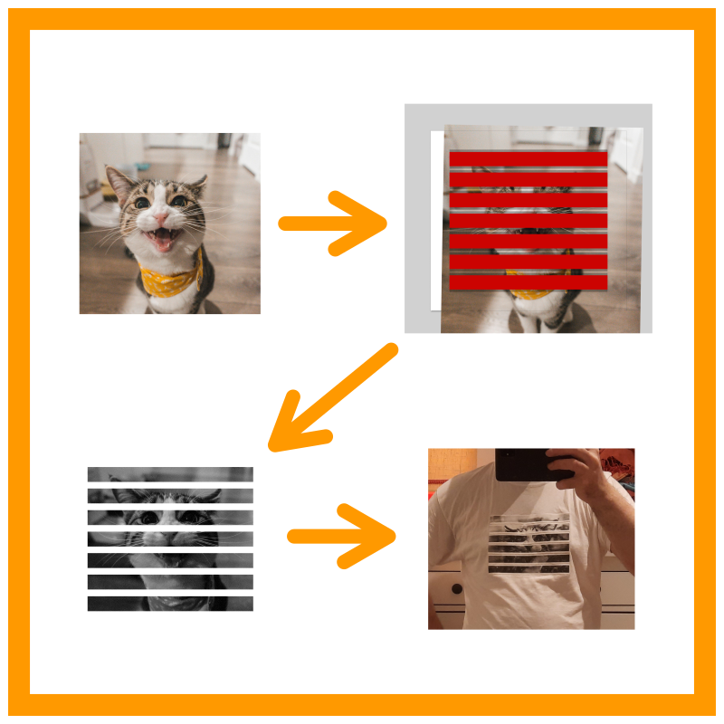

taep: Print pictures as collages with label tape printers
===========================================================

  The `taep` workflow from artwork to a physical T-shirt using iron-on label tape. Cat photo by `Jae Park <https://unsplash.com/photos/brown-tabby-cat-7GX5aICb5i4>`__.

``taep`` is a tool that helps you create collages out of label tape printed with a label printer such as Brother's
P-touch devices.

``taep dither`` takes an SVG file with your design and some lines representing the labels' locations, and
outputs a list of dithered PNG files, one for each label, ready for printing. Optionally, ``taep print`` can also directly
print these rendered images for you using the ``ptouch-print`` tool.

For creating and tweaking your design, ``taep`` has several helper utilities built-in. ``taep template`` will generate a
template with a label tape layout you give it that you can use to base your design off of. ``taep preview`` will render
a preview that approximates how the printed labels will look when you lay them out. ``taep assembly`` will render an
assembly diagram with labels indicating each label tape's number in the order output by ``taep dither`` or `taep
print`.

Quick start
-----------

1. Install ``taep`` from PyPI using `pip install taep`, and install ``usvg``, ``resvg``, ``didder`` and ``ptouch-print`` as
   shown below under Dependencies_.
2. Run ``taep template template.svg`` to create a template with pre-generated label tape areas. The default tape width
   is 24mm, but you can adjust this as you wish.
3. Create a new SVG document and design your artwork in it.
4. Copy the label tape areas from the template into your artwork SVG and save the resulting SVG. ``taep`` will later
   identify these areas by their color. You can copy or delete these, change the length of them, and move and rotate
   them as you wish. Just make sure you don't skew or shear them and that you don't change their width so that they
   still match the width of the tape that's physically in the printer you're using.
5. Run ``taep preview artwork_with_label_areas.svg`` on this SVG to render a preview image. By default, ``taep`` will
   open this preview image in your browser. If that doesn't work, run ``taep preview [input].svg preview_out.svg`` to
   write it to `preview_out.svg` and open that file with an SVG viewer of your choice. Adjust the content of your design
   as necessary.
6. Run ``taep print artwork_with_label_areas.svg`` to print your artwork to a brother P-touch label printer connected
   via USB.

Dependencies
------------

usvg
    ``usvg`` can be installed using ``cargo install usvg``.

    ``usvg`` is used by ``taep`` to simplify the input SVG file before processing it.

resvg
    ``resvg`` can be installed using ``cargo install resvg``.

    ``taep`` uses ``resvg`` to rasterize the SVG file.

didder
    ``didder`` can be installed from source at `https://github.com/makew0rld/didder <https://github.com/makew0rld/didder>`__.

    ``taep`` uses ``didder`` to dither the rasterized input, because these thermal label printers can only print two
    colors and do not support grayscale.

ptouch-print (optional)
    ``ptouch-print`` can be installed from source at `https://git.familie-radermacher.ch/linux/ptouch-print.git <https://git.familie-radermacher.ch/linux/ptouch-print.git>`__.

    ``taep`` uses ``ptouch-print`` when you ask it to print the generated labels using ``taep print``. You can also use
    ``taep dither`` to just generate a pile of PNGs, and use something else to print them.

Command-Line Interface Usage
----------------------------

You can override where ``taep`` looks for ``usvg``, ``resvg``, ``didder`` and ``ptouch-print`` by passing the full path to a
binary through the environment variables ``USVG``, ``RESVG``, ``DIDDER`` and ``PTOUCH_PRINT``.

You can override didder's dithering settings by passing the environment variable `DIDDER_ARGS`. The default value used
when this variable is not set is `edm --serpentine FloydSteinberg`.

.. code-block:: shell

    bigdata~/p/taep <3 python -m taep --help
    Usage: python -m taep [OPTIONS] COMMAND [ARGS]...

    Options:
      --help  Show this message and exit.

    Commands:
      assembly
      dither
      preview
      print
      template

``taep template``
~~~~~~~~~~~~~~~~~~~

.. code-block:: shell

    bigdata~/p/taep <3 python -m taep template --help
    Usage: python -m taep template [OPTIONS] [OUTPUT_SVG]

    Options:
      --num-rows INTEGER    Number of tapes
      --tape-width FLOAT    Width of tape
      --tape-border FLOAT   Width of empty border at the edges of the tape in mm
      --tape-spacing FLOAT  Space between tapes
      --tape-length FLOAT   Length of tape segments
      --magic-color TEXT    SVG color of tape
      --help                Show this message and exit.

``taep preview``
~~~~~~~~~~~~~~~~~~

.. code-block:: shell

    bigdata~/p/taep <3 python -m taep preview --help
    Usage: python -m taep preview [OPTIONS] [INPUT_SVG] [OUTPUT_SVG]

    Options:
      --magic-color TEXT      SVG color of tape
      --dpi FLOAT             Printer bitmap resolution in DPI
      --pixel-height INTEGER  Printer tape vertical pixel height
      --help                  Show this message and exit.

``taep dither``
~~~~~~~~~~~~~~~~~

.. code-block:: shell

    bigdata~/p/taep <3 python -m taep dither --help
    Usage: python -m taep dither [OPTIONS] [INPUT_SVG] OUTPUT_DIR

    Options:
      --magic-color TEXT      SVG color of tape
      --dpi FLOAT             Printer bitmap resolution in DPI
      --pixel-height INTEGER  Printer tape vertical pixel height
      --help                  Show this message and exit.

``taep print``
~~~~~~~~~~~~~~~~

.. code-block:: shell

    bigdata~/p/taep <3 python -m taep print --help
    Usage: python -m taep print [OPTIONS] [INPUT_SVG]

    Options:
      --magic-color TEXT        SVG color of tape
      --dpi FLOAT               Printer bitmap resolution in DPI
      --pixel-height INTEGER    Printer tape vertical pixel height
      --confirm / --no-confirm  Ask for confirmation before printing each tape
      --tape TEXT               The index numbers of which tapes to print. Comma-
                                separate list, each entry is either a single
                                number or a "3-5" style range where both ends are
                                included.
      --help                    Show this message and exit.

``taep assembly``
~~~~~~~~~~~~~~~~~~~

.. code-block:: shell

    bigdata~/p/taep <3 python -m taep assembly --help
    Usage: python -m taep assembly [OPTIONS] [INPUT_SVG] [OUTPUT_SVG]

    Options:
      --magic-color TEXT      SVG color of tape
      --dpi FLOAT             Printer bitmap resolution in DPI
      --pixel-height INTEGER  Printer tape vertical pixel height
      --help                  Show this message and exit.

